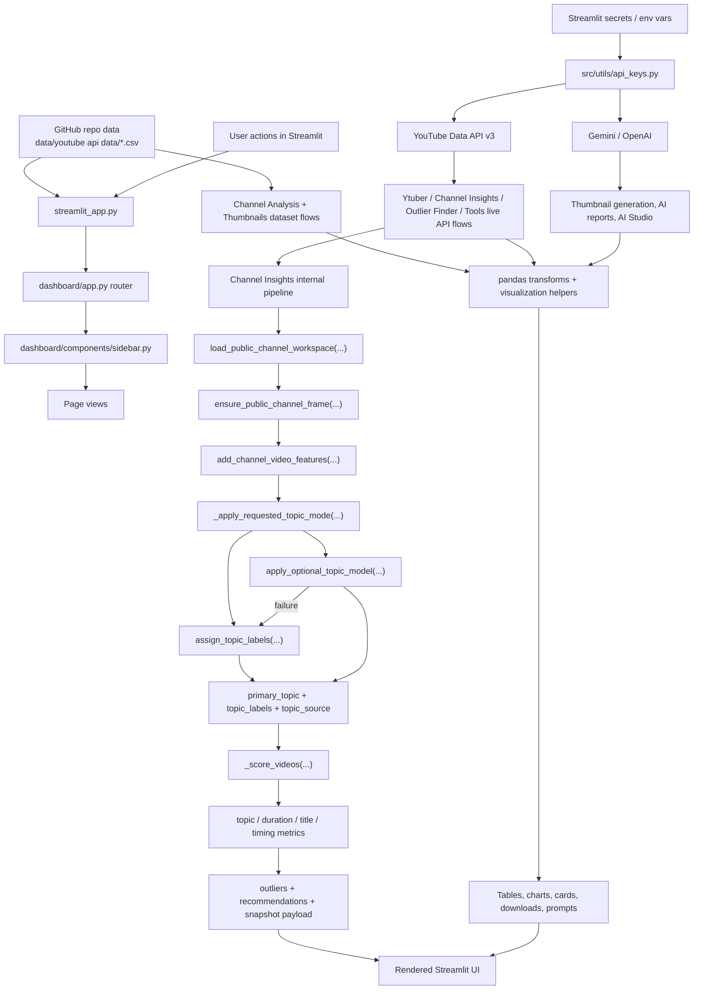
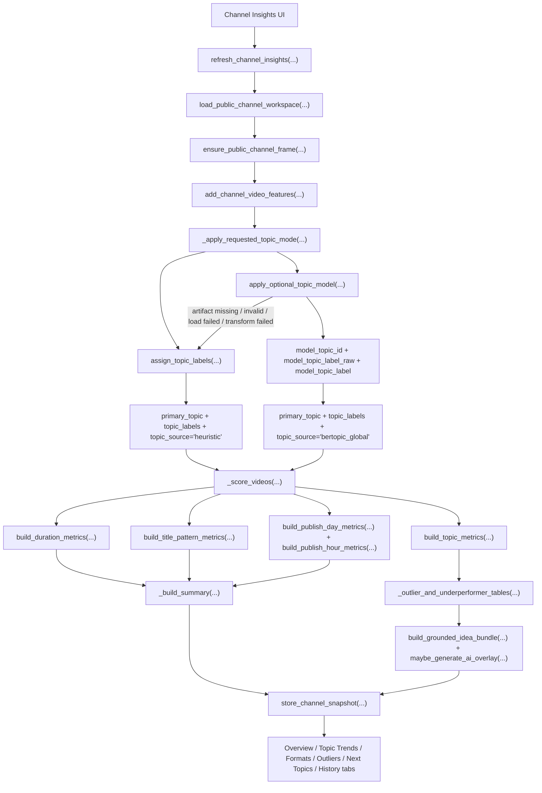
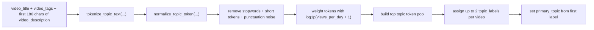
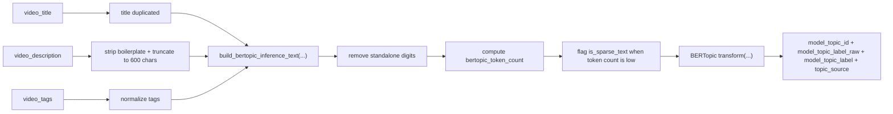
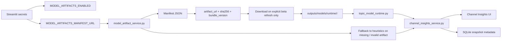

# YouTube IP V5

YouTube IP V5 is the lighter Streamlit branch for YouTube benchmarking, public channel intelligence, thumbnail work, outlier research, and the retained AI suite pages.

## Branch And Deploy Targets

- Original repo branch tag: `youtube-ip-v5`
- Original repo: `matt-foor/purdue-youtube-ip`
- Deploy repo: `royayushkr/Youtube-IP-V5`
- Deploy branch: `main`
- PR branch reference: [youtube-ip-v5](https://github.com/matt-foor/purdue-youtube-ip/tree/youtube-ip-v5)

## Sidebar Navigation

1. `Channel Analysis`
2. `Channel Insights`
3. `Thumbnails`
4. `Outlier Finder`
5. `Ytuber`
6. `Tools`
7. `Deployment`

V5 removes the global `Assistant` and removes Google OAuth from `Channel Insights`, but it keeps `Ytuber`, `Tools`, and `Deployment`.

## What Each Page Solves

| Page | Problem Solved | Main Inputs And Services | Main Outputs |
| --- | --- | --- | --- |
| `Channel Analysis` | Benchmark bundled YouTube datasets by category, channel, and time range | CSV files in `data/youtube api data/`, pandas, visualization helpers | KPI cards, trend charts, top channels, top videos |
| `Channel Insights` | Track a public channel over time and understand what is working now | `public_channel_service`, `channel_snapshot_store`, `channel_insights_service`, optional BERTopic | snapshot history, topic trends, format patterns, outliers, next-topic ideas |
| `Thumbnails` | Generate or export thumbnails without mixing in broader strategy UI | `thumbnail_generator.py`, `thumbnail_hub_service.py`, public YouTube thumbnail URLs | generated thumbnails, preview cards, downloadable images |
| `Outlier Finder` | Discover overperforming videos in a niche | `outliers_finder.py`, `outlier_ai.py`, YouTube Data API | scored outlier tables, breakout charts, AI research cards |
| `Ytuber` | Work on one live channel with creator-focused AI tooling | YouTube Data API, pooled API keys, thumbnail generator, outlier handoff | AI Studio outputs, audit views, keyword insights, planner views |
| `Tools` | Export or inspect public YouTube assets | `youtube_tools.py`, `transcript_service.py`, `yt-dlp`, `ffmpeg` | metadata previews, transcript exports, audio/video downloads, thumbnail downloads |
| `Deployment` | Show deployment and setup instructions inside the app | static app guidance in `dashboard/app.py` | deploy notes and secrets setup |

## End-To-End Data Pipeline



## Live API Extraction Flow

```mermaid
flowchart LR
    A["User enters query, channel, or URL"] --> B["Page view"]
    B --> C["src/utils/api_keys.py"]
    C --> D["Provider key selection"]
    D --> E["YouTube Data API request"]
    E --> F["Service-layer normalization"]
    F --> G["pandas dataframes + scored payloads"]
    G --> H["dashboard/components/visualizations.py"]
    H --> I["Charts, tables, cards, and actions"]
```



In V5, `Channel Insights` is public-only. It does not use Google OAuth and it does not request owner-only YouTube Analytics overlays.

## How Channel Insights Topic Modes Are Integrated

`Channel Insights` always starts with the same public-channel workspace. The split between `Heuristic Topics` and `Model-Backed Topics (Beta)` happens only after `add_channel_video_features(...)` has created the base feature frame.



The important piece is that heuristic and beta are not two separate products. They are two topic-assignment modes inside the same refresh path. Once the dataframe has `primary_topic`, `topic_labels`, and `topic_source`, the downstream metrics, summaries, recommendations, and tabs are shared.

### What The Topic Labels Feed

- `primary_topic` becomes the grouping key for `build_topic_metrics(...)`.
- `topic_labels` and `topic_source` stay attached to each video row and are persisted in the snapshot payload.
- duration, title-pattern, publish-day, and publish-hour metrics are built from the same enriched dataframe after topic assignment.
- outlier and underperformer tables use `performance_score`, but the explanation strings shown in the UI use `primary_topic`.
- next-topic recommendations and the optional AI overlay run after the metric tables exist, so both topic modes feed the same downstream recommendation layer.

### Heuristic Vs Model-Backed Topics

- `Heuristic Topics`
  - tokenizes the title, tags, and a description excerpt
  - normalizes tokens and filters stopwords / weak tokens
  - weights tokens using a log-scaled `views_per_day` signal
  - is always available and stays the default
- `Model-Backed Topics (Beta)`
  - preprocesses text for BERTopic inference
  - requires the manifest plus the external model bundle
  - only runs when the user explicitly requests beta mode
  - falls back to heuristics on any artifact, load, or transform failure

### Heuristic Topic Derivation



### BERTopic Beta Preprocessing



## Model-Backed Topics In Channel Insights

Plain-language topic modes:

- `Heuristic Topics` = built-in keyword and rule grouping from titles, descriptions, and tags
- `Model-Backed Topics` = optional BERTopic semantic grouping loaded only when beta mode is explicitly requested



Current V5 manifest URL:

- `https://raw.githubusercontent.com/royayushkr/Youtube-IP-V5/main/data/model_manifests/bertopic_manifest_2026.03.27.json`

## Streamlit Secrets

```toml
YOUTUBE_API_KEYS = ["your_youtube_key_1", "your_youtube_key_2"]
GEMINI_API_KEYS = ["your_gemini_key_1", "your_gemini_key_2"]
OPENAI_API_KEYS = ["your_openai_key_1", "your_openai_key_2"]

MODEL_ARTIFACTS_ENABLED = true
MODEL_ARTIFACTS_MANIFEST_URL = "https://raw.githubusercontent.com/royayushkr/Youtube-IP-V5/main/data/model_manifests/bertopic_manifest_2026.03.27.json"
MODEL_ARTIFACTS_CACHE_DIR = "outputs/models/runtime"
MODEL_ARTIFACTS_DOWNLOAD_TIMEOUT_SECONDS = 300
MODEL_ARTIFACTS_MAX_SIZE_MB = 512
```

## Version Comparison

| Area | V4 | V5 |
| --- | --- | --- |
| Sidebar Assistant | Present | Removed |
| Google OAuth | Present | Removed |
| Channel Insights | Public + optional owner overlays | Public-only |
| Page 3 label | `Recommendations` | `Thumbnails` |
| Ytuber | Present | Present |
| Tools | Present | Present |
| Deployment page | Present | Present |
| BERTopic beta | Optional | Optional |

## Local Run

```bash
python3 -m venv .venv
source .venv/bin/activate
pip install -r requirements.txt
streamlit run streamlit_app.py
```

More detailed technical flow:

- [Architecture](docs/ARCHITECTURE.md)
- [Deployment And Versions](docs/DEPLOYMENT_AND_VERSIONS.md)
