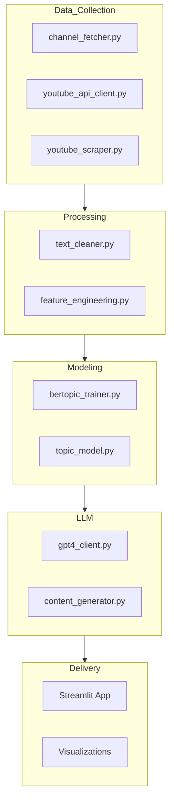

# System Architecture

This document captures the high-level architecture, core components, and data flow.

## End-to-End Flow
```mermaid
flowchart LR
    A[YouTube Data API v3] --> B[Raw Data Store]
    C[Public Captions] --> B
    D[Google Trends (Optional)] --> B
    B --> E[Data Cleaning & Feature Engineering]
    E --> F[Topic Modeling - BERTopic]
    E --> G[Engagement Analytics]
    F --> H[Semantic Themes & Clusters]
    G --> I[High-Engagement Patterns]
    H --> J[LLM Strategy Generator]
    I --> J
    J --> K[Streamlit Dashboard]
    K --> L[Recommendations & Insights]
```

## Component Responsibilities


## Data Artifacts
- **Raw Data:** `data/raw/`
- **Processed Data:** `data/processed/`
- **Models:** `outputs/models/`
- **Visuals and Reports:** `outputs/figures/`, `outputs/reports/`
