# YouTube IP V5 Architecture

This document is the current-runtime reference for V5. The version-history story lives in the README and project brief; this file focuses on how the deployed app works today, page by page and service by service.

## Deep-Dive Guide

- [Channel Analysis](#channel-analysis)
- [Channel Insights](#channel-insights)
- [Thumbnails](#thumbnails)
- [Outlier Finder](#outlier-finder)
- [Ytuber](#ytuber)
- [Tools](#tools)
- [Deployment](#deployment)
- [Model-Backed Topic Artifact Flow](#model-backed-topic-artifact-flow)

## Runtime Inventory

| Item | Count | Notes |
| --- | --- | --- |
| Streamlit entrypoints | `2` | `streamlit_app.py` and `dashboard/app.py` |
| Current sidebar destinations | `7` | `Channel Analysis`, `Channel Insights`, `Thumbnails`, `Outlier Finder`, `Ytuber`, `Tools`, `Deployment` |
| Primary runtime data paths | `2` | bundled GitHub CSVs and live API-backed requests |
| Live provider families | `3` | `YouTube`, `Gemini`, `OpenAI` |
| Channel Insights topic modes | `2` | `Heuristic Topics` and `Model-Backed Topics (Beta)` |
| Channel Insights tabs | `6` | `Overview`, `Topic Trends`, `Formats & Patterns`, `Outliers`, `Next Topics`, `History` |
| Thumbnails tabs | `2` | `Generate`, `Download From URL` |
| Tools tabs | `3` | `Single`, `Batch`, `Playlist` |
| Ytuber workspace modules | `8` | `AI Studio`, `Overview`, `Channel Audit`, `Keyword Intel`, `Outliers Finder`, `Title & SEO Lab`, `Competitor Benchmark`, `Content Planner` |
| Main Outlier Finder post-search sections | `4` | `Top Outliers In This Scan`, `Breakout Snapshot`, `AI Research`, `How This Works` |

## Sidebar Navigation

1. `Channel Analysis`
2. `Channel Insights`
3. `Thumbnails`
4. `Outlier Finder`
5. `Ytuber`
6. `Tools`
7. `Deployment`

V5 removes the sidebar `Assistant` and removes Google OAuth from `Channel Insights`, but keeps the broader AI suite pages.

## Full V5 Runtime And Data Pipeline

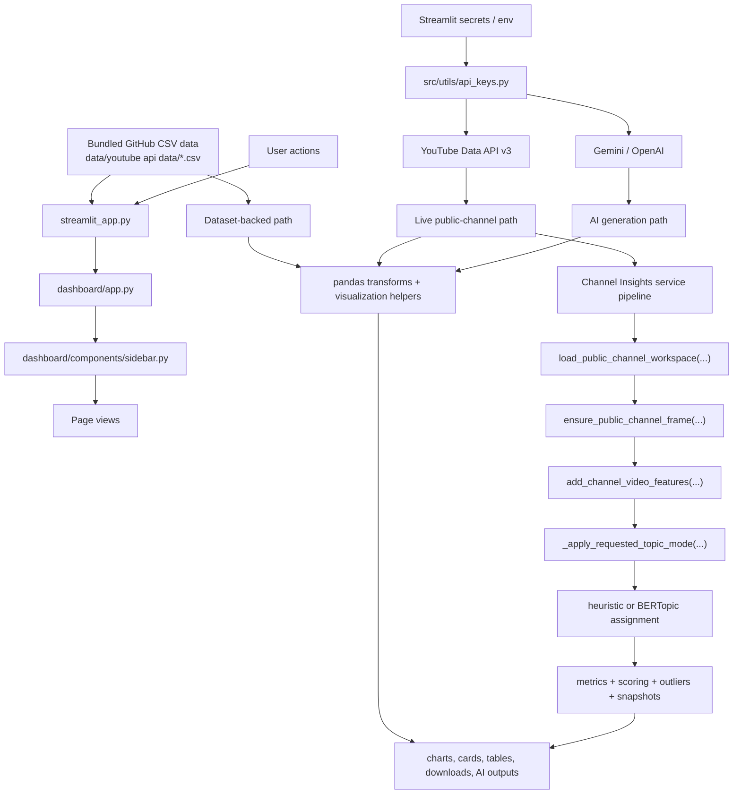
```mermaid
flowchart TD
    A["Bundled GitHub CSV data<br/>data/youtube api data/*.csv"] --> B["streamlit_app.py"]
    U["User actions"] --> B
    B --> C["dashboard/app.py"]
    C --> D["dashboard/components/sidebar.py"]
    D --> E["Page views"]

    S["Streamlit secrets / env"] --> F["src/utils/api_keys.py"]
    F --> G["YouTube Data API v3"]
    F --> H["Gemini / OpenAI"]

    A --> I["Dataset-backed path"]
    G --> J["Live public-channel path"]
    H --> K["AI generation path"]

    I --> L["pandas transforms + visualization helpers"]
    J --> L
    K --> L

    J --> M["Channel Insights service pipeline"]
    M --> M1["load_public_channel_workspace(...)"]
    M1 --> M2["ensure_public_channel_frame(...)"]
    M2 --> M3["add_channel_video_features(...)"]
    M3 --> M4["_apply_requested_topic_mode(...)"]
    M4 --> M5["heuristic or BERTopic assignment"]
    M5 --> M6["metrics + scoring + outliers + snapshots"]

    L --> N["charts, cards, tables, downloads, AI outputs"]
    M6 --> N
```

## API Data Pipeline Overview

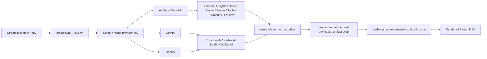
```mermaid
flowchart LR
    A["Streamlit secrets / env"] --> B["src/utils/api_keys.py"]
    B --> C["Select / rotate provider key"]

    C --> D["YouTube Data API"]
    C --> E["Gemini"]
    C --> F["OpenAI"]

    D --> G["Channel Insights / Outlier Finder / Ytuber / Tools / Thumbnail URL flow"]
    E --> H["Thumbnails / Ytuber AI Studio / Outlier AI"]
    F --> H

    G --> I["service-layer normalization"]
    H --> I
    I --> J["pandas frames / scored payloads / artifact prep"]
    J --> K["dashboard/components/visualizations.py"]
    K --> L["Rendered Streamlit UI"]
```

## Page Problem Map

| Page | Problem Solved | Main Services / Inputs | Main UI Outputs | Runtime Type |
| --- | --- | --- | --- | --- |
| `Channel Analysis` | benchmark committed cross-channel datasets | CSVs, pandas, visualization helpers | KPI cards, trend charts, ranked tables | dataset-backed |
| `Channel Insights` | analyze one tracked public channel over time | `public_channel_service`, `channel_snapshot_store`, `channel_insights_service`, `topic_model_runtime`, `model_artifact_service` | topic trends, format analysis, outliers, next-topic ideas, history | mixed |
| `Thumbnails` | generate and export thumbnails without broader strategy clutter | `thumbnail_generator.py`, `thumbnail_hub_service.py`, provider keys, public thumbnail URLs | generated images, preview cards, downloads | mixed |
| `Outlier Finder` | find niche winners using explainable scoring | `outliers_finder.py`, `outlier_ai.py`, YouTube API | scored outlier tables, breakout charts, AI research | mixed |
| `Ytuber` | run a live creator AI workspace for one channel | YouTube API loaders, scoring helpers, thumbnail generator, AI generation | audits, AI Studio, keyword and planner outputs | mixed |
| `Tools` | inspect and export public YouTube assets | `youtube_tools.py`, `transcript_service.py`, `yt-dlp`, `ffmpeg` | metadata previews, transcript/audio/video/thumbnail downloads | API-backed |
| `Deployment` | explain setup and deployment in the app shell | static app guidance | setup and deploy notes | static |

## Channel Analysis

`Channel Analysis` is the most direct continuation of the original V1 dataset analytics idea. It stays entirely on the bundled CSV path.

### Current Data Flow

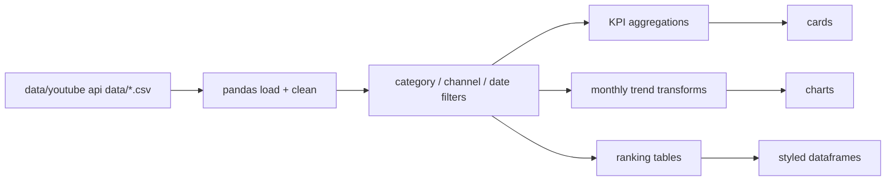
```mermaid
flowchart LR
    A["data/youtube api data/*.csv"] --> B["pandas load + clean"]
    B --> C["category / channel / date filters"]
    C --> D["KPI aggregations"]
    C --> E["monthly trend transforms"]
    C --> F["ranking tables"]
    D --> G["cards"]
    E --> H["charts"]
    F --> I["styled dataframes"]
```

### What it outputs today

- high-level KPI summaries
- monthly upload and performance trends
- top channels and top videos
- benchmark views of publishing behavior across the bundled dataset

## Channel Insights

`Channel Insights` is the deepest current analysis path in V5. It is public-only, snapshot-based, and shares one refresh pipeline regardless of topic mode.

### Connect And Refresh Flow

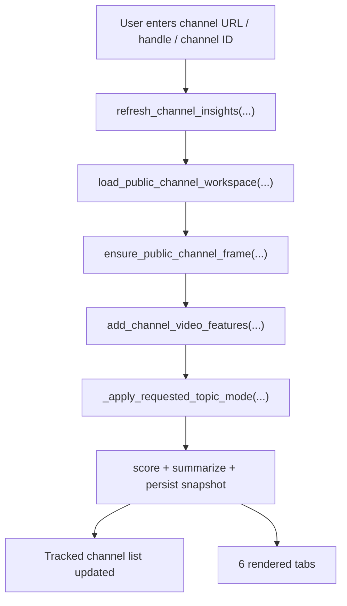
```mermaid
flowchart TD
    A["User enters channel URL / handle / channel ID"] --> B["refresh_channel_insights(...)"]
    B --> C["load_public_channel_workspace(...)"]
    C --> D["ensure_public_channel_frame(...)"]
    D --> E["add_channel_video_features(...)"]
    E --> F["_apply_requested_topic_mode(...)"]
    F --> G["score + summarize + persist snapshot"]
    G --> H["Tracked channel list updated"]
    G --> I["6 rendered tabs"]
```

### Topic-Mode Integration

The split between topic modes happens only after the same base public-channel dataframe is built.

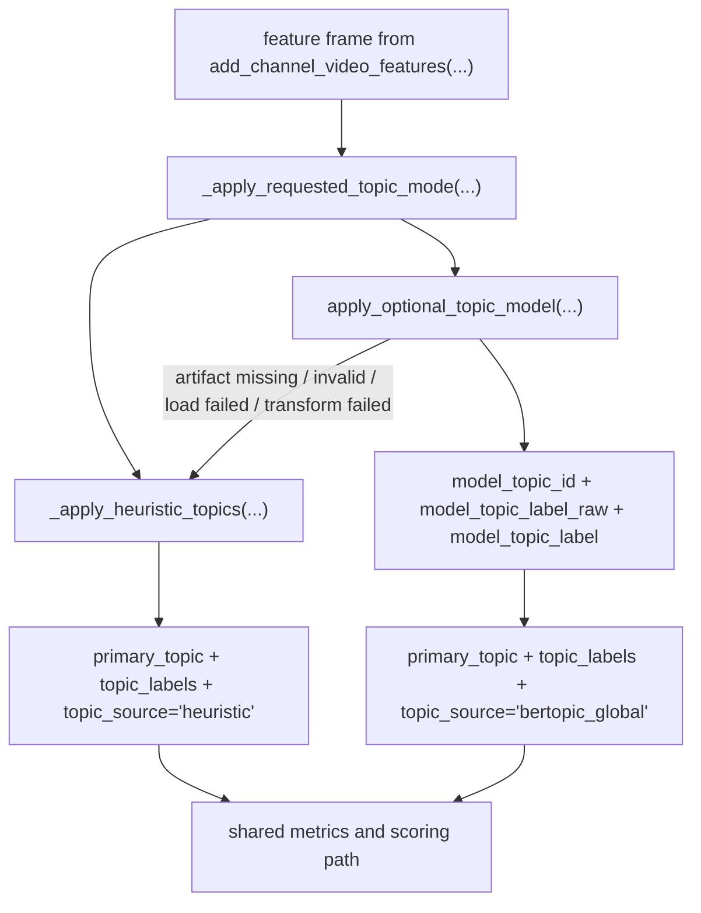
```mermaid
flowchart TD
    A["feature frame from add_channel_video_features(...)"] --> B["_apply_requested_topic_mode(...)"]
    B --> C["_apply_heuristic_topics(...)"]
    B --> D["apply_optional_topic_model(...)"]
    D -->|artifact missing / invalid / load failed / transform failed| C
    C --> E["primary_topic + topic_labels + topic_source='heuristic'"]
    D --> F["model_topic_id + model_topic_label_raw + model_topic_label"]
    F --> G["primary_topic + topic_labels + topic_source='bertopic_global'"]
    E --> H["shared metrics and scoring path"]
    G --> H
```

### What The Topic Fields Feed

| Field | Role In The Pipeline |
| --- | --- |
| `primary_topic` | grouping key for topic metrics and explanation text |
| `topic_labels` | per-video label list for inspection and grouping |
| `topic_source` | records whether the row came from heuristics or BERTopic beta |
| `model_topic_id` | raw BERTopic id retained when beta succeeds |
| `model_topic_label_raw` | direct label read from the model |
| `model_topic_label` | human-readable cleaned label used in the UI |

Those fields feed:

- topic metrics
- duration metrics
- title-pattern metrics
- outlier and underperformer tables
- next-topic recommendations
- persisted snapshot metadata

### Heuristic Vs Model-Backed Topics

| Mode | Better For | Constraint | Why It Exists |
| --- | --- | --- | --- |
| `Heuristic Topics` | speed, deploy safety, transparent token-based grouping | more literal topic grouping | always-available default |
| `Model-Backed Topics (Beta)` | semantic grouping across different phrasings | depends on external artifact readiness | optional richer topic clustering |

### BERTopic Artifact State Table

| Artifact State | What It Means | What The UI Shows |
| --- | --- | --- |
| `disabled` | model artifacts are not enabled in config | `Unavailable` |
| `unconfigured` | manifest URL or other required config is missing | `Unavailable` |
| `download_required` | beta is configured but artifact is not cached yet | `Download Required` |
| `ready` | artifact bundle is cached and loadable | `Ready` |
| `invalid` | manifest, checksum, or extracted bundle is not usable | `Failed / Fallback Active` |

### Heuristic Topic Derivation

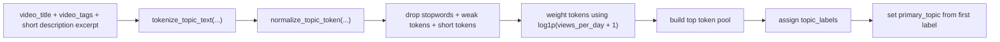
```mermaid
flowchart LR
    A["video_title + video_tags + short description excerpt"] --> B["tokenize_topic_text(...)"]
    B --> C["normalize_topic_token(...)"]
    C --> D["drop stopwords + weak tokens + short tokens"]
    D --> E["weight tokens using log1p(views_per_day + 1)"]
    E --> F["build top token pool"]
    F --> G["assign topic_labels"]
    G --> H["set primary_topic from first label"]
```

### BERTopic Beta Preprocessing

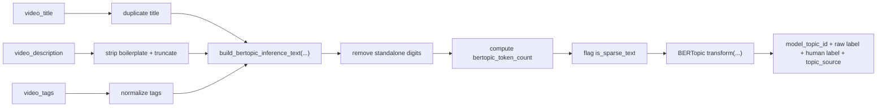
```mermaid
flowchart LR
    A["video_title"] --> B["duplicate title"]
    C["video_description"] --> D["strip boilerplate + truncate"]
    E["video_tags"] --> F["normalize tags"]
    B --> G["build_bertopic_inference_text(...)"]
    D --> G
    F --> G
    G --> H["remove standalone digits"]
    H --> I["compute bertopic_token_count"]
    I --> J["flag is_sparse_text"]
    J --> K["BERTopic transform(...)"]
    K --> L["model_topic_id + raw label + human label + topic_source"]
```

### Channel Insights Tab Flow

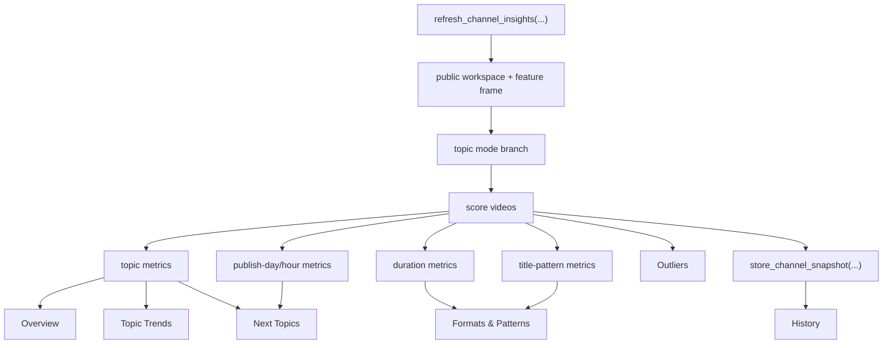
```mermaid
flowchart TD
    A["refresh_channel_insights(...)"] --> B["public workspace + feature frame"]
    B --> C["topic mode branch"]
    C --> D["score videos"]
    D --> E["topic metrics"]
    D --> F["duration metrics"]
    D --> G["title-pattern metrics"]
    D --> H["publish-day/hour metrics"]
    E --> I["Overview"]
    E --> J["Topic Trends"]
    F --> K["Formats & Patterns"]
    G --> K
    D --> L["Outliers"]
    E --> M["Next Topics"]
    H --> M
    D --> N["store_channel_snapshot(...)"]
    N --> O["History"]
```

### What each Channel Insights tab does

| Tab | Current Purpose | Main Inputs |
| --- | --- | --- |
| `Overview` | summarize strongest signals, best duration/title pattern, and current channel state | summary payload, recommendation summary, topic/duration metrics |
| `Topic Trends` | show which themes are winning or fading | topic metrics dataframe and topic labels |
| `Formats & Patterns` | compare duration buckets, title patterns, and packaging effects | duration metrics and title-pattern metrics |
| `Outliers` | surface strongest and weakest recent videos with explanations | scored video frame and outlier tables |
| `Next Topics` | turn current strengths and gaps into grounded future ideas | recommendation bundle and theme cards |
| `History` | compare snapshots over time | persisted channel snapshot store |

## Thumbnails

`Thumbnails` is intentionally a narrow, thumbnail-only workspace in V5. It has two tabs and no broader recommendation clutter.

### Generate Tab

This tab is AI-backed and uses `ThumbnailGenerator` plus current provider/model settings.

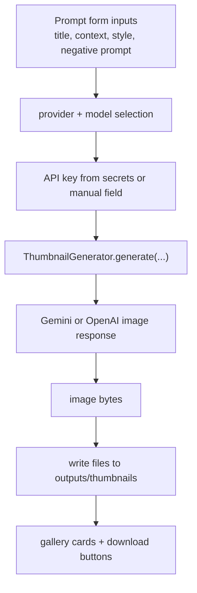
```mermaid
flowchart TD
    A["Prompt form inputs<br/>title, context, style, negative prompt"] --> B["provider + model selection"]
    B --> C["API key from secrets or manual field"]
    C --> D["ThumbnailGenerator.generate(...)"]
    D --> E["Gemini or OpenAI image response"]
    E --> F["image bytes"]
    F --> G["write files to outputs/thumbnails"]
    G --> H["gallery cards + download buttons"]
```

Current generate-tab behavior:

- supports `Gemini` and `OpenAI`
- exposes model-specific size and quality settings
- exposes `background` and `output format` when using OpenAI image models
- estimates run cost before generation
- writes generated files into `outputs/thumbnails`
- renders per-image download buttons immediately

### Download From URL Tab

This tab is API/public-web-backed and uses `thumbnail_hub_service.py`.

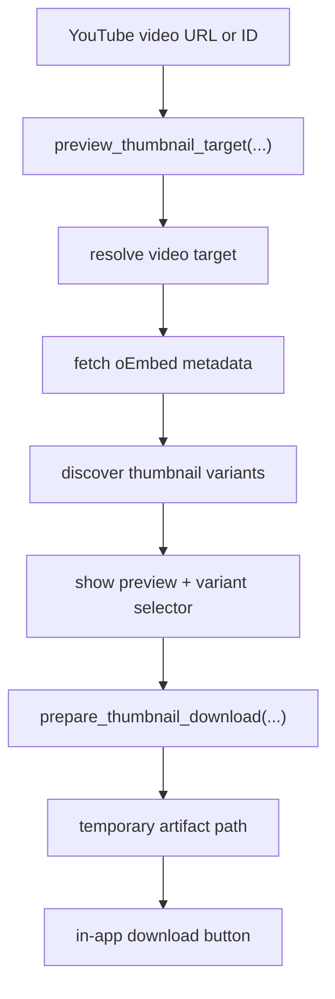
```mermaid
flowchart TD
    A["YouTube video URL or ID"] --> B["preview_thumbnail_target(...)"]
    B --> C["resolve video target"]
    C --> D["fetch oEmbed metadata"]
    D --> E["discover thumbnail variants"]
    E --> F["show preview + variant selector"]
    F --> G["prepare_thumbnail_download(...)"]
    G --> H["temporary artifact path"]
    H --> I["in-app download button"]
```

Current download-tab behavior:

- accepts watch URLs, Shorts URLs, `youtu.be` URLs, or raw video IDs
- previews the public thumbnail variants exposed by YouTube
- keeps the flow thumbnail-only
- prepares a temporary artifact for download rather than mixing in transcript/audio/video tooling

## Outlier Finder

`Outlier Finder` is an evidence-first, AI-second workflow. It starts from a structured search request, builds a candidate frame, scores outliers, and only then offers AI interpretation.

### Search And Scoring Flow

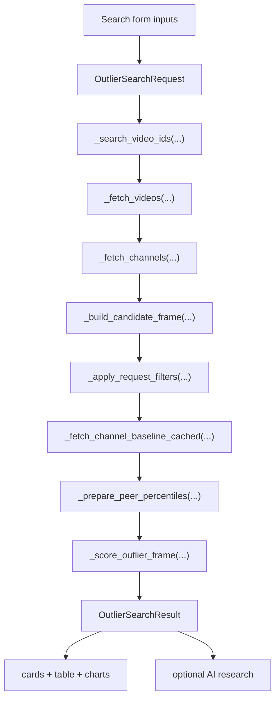
```mermaid
flowchart TD
    A["Search form inputs"] --> B["OutlierSearchRequest"]
    B --> C["_search_video_ids(...)"]
    C --> D["_fetch_videos(...)"]
    D --> E["_fetch_channels(...)"]
    E --> F["_build_candidate_frame(...)"]
    F --> G["_apply_request_filters(...)"]
    G --> H["_fetch_channel_baseline_cached(...)"]
    H --> I["_prepare_peer_percentiles(...)"]
    I --> J["_score_outlier_frame(...)"]
    J --> K["OutlierSearchResult"]
    K --> L["cards + table + charts"]
    K --> M["optional AI research"]
```

### What the search form controls

- niche query
- timeframe and custom date range
- broad vs exact match mode
- region and language
- freshness focus
- duration preference
- language strictness
- minimum views
- subscriber range and hidden-subscriber handling
- excluded keywords
- search depth and baseline limits

### Post-search result sections

| Section | What It Does |
| --- | --- |
| `Top Outliers In This Scan` | shows the scored winner set first, with result cards and the full sortable table |
| `Breakout Snapshot` | visualizes score, velocity, packaging, duration, age, and scan quality |
| `AI Research` | converts the evidence into structured research cards only after the results are visible |
| `How This Works` | explains the scoring methodology and caveats |

### Outlier Finder presentation flow

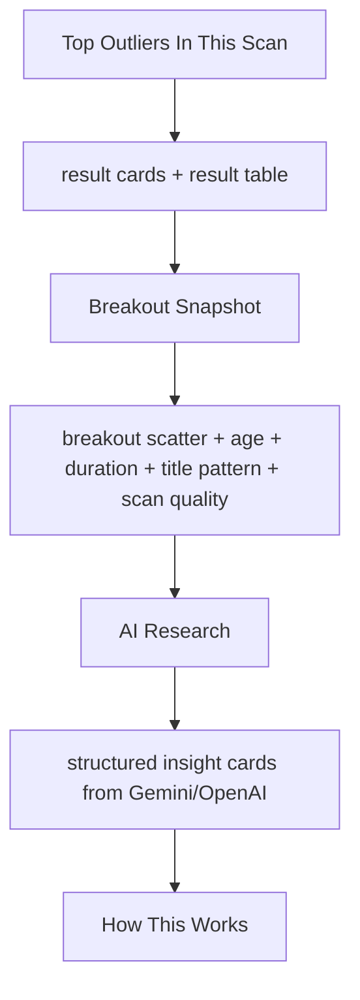
```mermaid
flowchart TD
    A["Top Outliers In This Scan"] --> B["result cards + result table"]
    B --> C["Breakout Snapshot"]
    C --> D["breakout scatter + age + duration + title pattern + scan quality"]
    D --> E["AI Research"]
    E --> F["structured insight cards from Gemini/OpenAI"]
    F --> G["How This Works"]
```

## Ytuber

`Ytuber` is a segmented live creator workspace, not a tabbed analytics page. It starts with a channel search, loads a workspace dataframe, and then lets the user switch across eight modules.

### Channel Load Flow

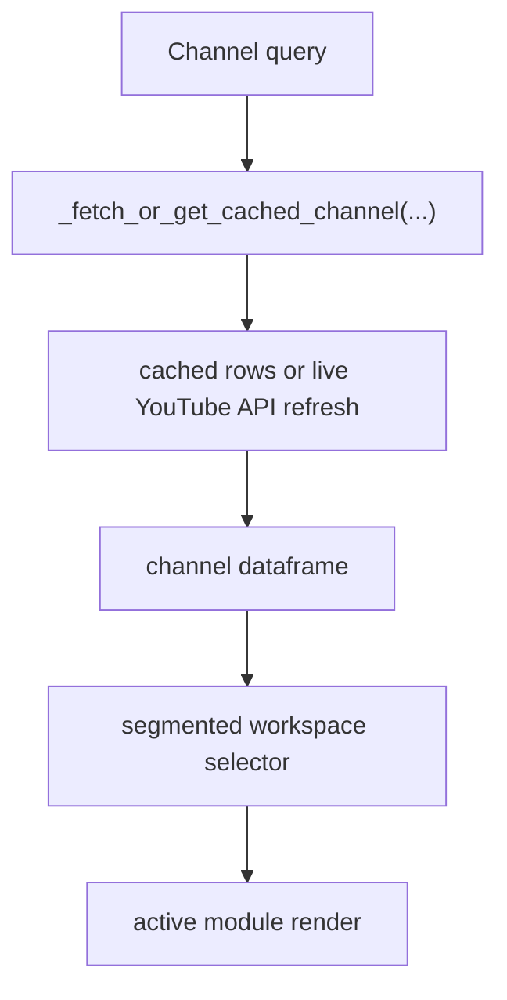
```mermaid
flowchart TD
    A["Channel query"] --> B["_fetch_or_get_cached_channel(...)"]
    B --> C["cached rows or live YouTube API refresh"]
    C --> D["channel dataframe"]
    D --> E["segmented workspace selector"]
    E --> F["active module render"]
```

### Current Ytuber modules

| Module | Current Role |
| --- | --- |
| `AI Studio` | generate titles, descriptions, scripts, hooks, ideas, and thumbnail concepts |
| `Overview` | summarize core channel performance and recent activity |
| `Channel Audit` | show channel consistency and performance quality checks |
| `Keyword Intel` | derive recent keyword patterns and opportunity cues |
| `Outliers Finder` | hand off into a channel-contextualized outlier workflow |
| `Title & SEO Lab` | score titles and descriptions and route weak directions into AI Studio |
| `Competitor Benchmark` | compare current channel behavior to selected competitors |
| `Content Planner` | turn current patterns into scheduling and planning suggestions |

### Ytuber workspace flow

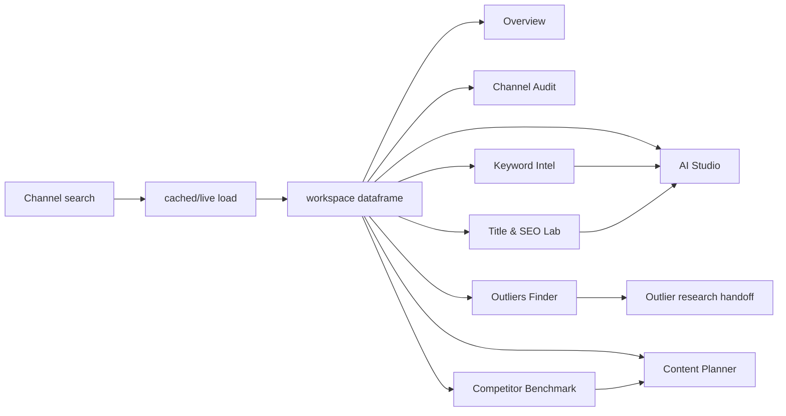
```mermaid
flowchart LR
    A["Channel search"] --> B["cached/live load"]
    B --> C["workspace dataframe"]
    C --> D["AI Studio"]
    C --> E["Overview"]
    C --> F["Channel Audit"]
    C --> G["Keyword Intel"]
    C --> H["Outliers Finder"]
    C --> I["Title & SEO Lab"]
    C --> J["Competitor Benchmark"]
    C --> K["Content Planner"]
    G --> D
    H --> L["Outlier research handoff"]
    I --> D
    J --> K
```

## Tools

`Tools` remains the broadest utility page in V5. It prepares public assets into temporary artifacts and keeps them itemized rather than creating a persistent media store.

### Tools tab structure

| Tab | Purpose | Main Services |
| --- | --- | --- |
| `Single` | inspect one public video or Short and prepare individual assets | `youtube_tools.py`, `transcript_service.py` |
| `Batch` | run one operation across many URLs with per-item results | `prepare_batch_operation(...)` in `youtube_tools.py` |
| `Playlist` | preview a public playlist, select items, and process them sequentially | `fetch_playlist_preview(...)`, `prepare_playlist_operation(...)` |

### Tools tab flow

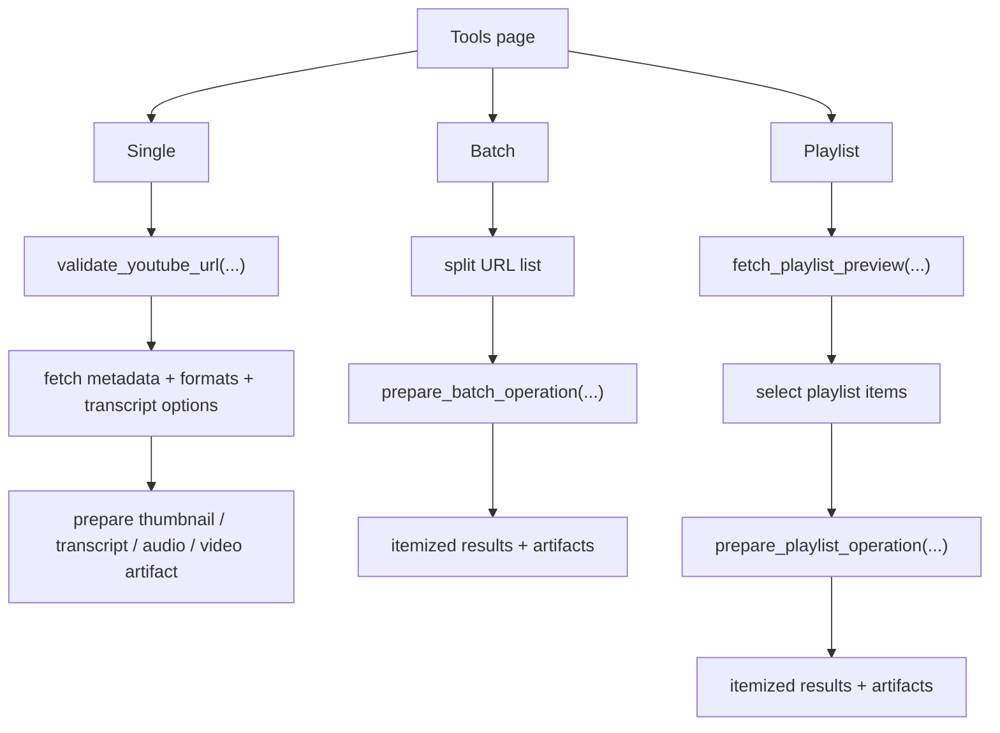
```mermaid
flowchart TD
    A["Tools page"] --> B["Single"]
    A --> C["Batch"]
    A --> D["Playlist"]

    B --> B1["validate_youtube_url(...)"]
    B1 --> B2["fetch metadata + formats + transcript options"]
    B2 --> B3["prepare thumbnail / transcript / audio / video artifact"]

    C --> C1["split URL list"]
    C1 --> C2["prepare_batch_operation(...)"]
    C2 --> C3["itemized results + artifacts"]

    D --> D1["fetch_playlist_preview(...)"]
    D1 --> D2["select playlist items"]
    D2 --> D3["prepare_playlist_operation(...)"]
    D3 --> D4["itemized results + artifacts"]
```

### Runtime constraints that matter

- downloads are prepared into temporary files
- large artifacts may exceed Streamlit in-app delivery limits
- some video/audio formats require `ffmpeg`
- private, age-gated, members-only, or region-restricted videos can fail

## Deployment

`Deployment` is the operational reference page inside the app shell. It does not run analysis itself; it explains how to run or deploy the app, which repo/branch is active, and which secrets need to exist.

### How it fits the shell

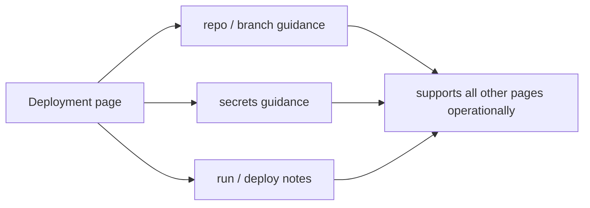
```mermaid
flowchart LR
    A["Deployment page"] --> B["repo / branch guidance"]
    A --> C["secrets guidance"]
    A --> D["run / deploy notes"]
    B --> E["supports all other pages operationally"]
    C --> E
    D --> E
```

## Model-Backed Topic Artifact Flow

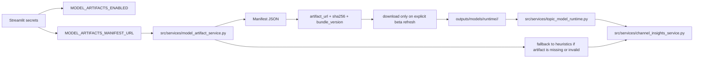
```mermaid
flowchart LR
    A["Streamlit secrets"] --> B["MODEL_ARTIFACTS_ENABLED"]
    A --> C["MODEL_ARTIFACTS_MANIFEST_URL"]
    C --> D["src/services/model_artifact_service.py"]
    D --> E["Manifest JSON"]
    E --> F["artifact_url + sha256 + bundle_version"]
    F --> G["download only on explicit beta refresh"]
    G --> H["outputs/models/runtime/<bundle_version>/"]
    H --> I["src/services/topic_model_runtime.py"]
    I --> J["src/services/channel_insights_service.py"]
    D --> K["fallback to heuristics if artifact is missing or invalid"]
    K --> J
```

## Cross-Version Architectural Summary

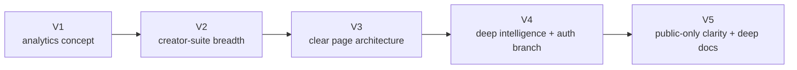
```mermaid
flowchart LR
    A["V1<br/>analytics concept"] --> B["V2<br/>creator-suite breadth"]
    B --> C["V3<br/>clear page architecture"]
    C --> D["V4<br/>deep intelligence + auth branch"]
    D --> E["V5<br/>public-only clarity + deep docs"]
```

| Version | Main Architectural Shift |
| --- | --- |
| `V1` | established the public-data analytics and modeling thesis |
| `V2` | expanded the product into a wide creator operating system |
| `V3` | clarified runtime shell, page ownership, and active services |
| `V4` | added Channel Insights, Assistant, Google OAuth, owner analytics, and optional BERTopic runtime |
| `V5` | removed Assistant and OAuth, kept the strongest workflows, and documented the current runtime in depth |
